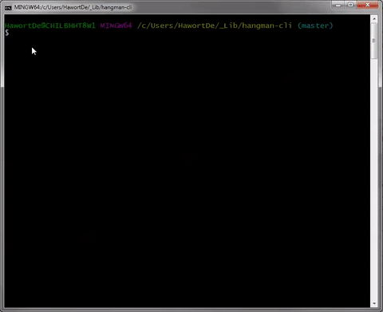

# hangman-cli-app
A hangman command-line-interface game.

## Tools and Tech
`JavaScript`,`JavaScript Constructor Functions`,`nodeJS`,`inquirer`,`love`

### How can I play the game?

1. Install node if it's not already.
2. Open the folder directory in your terminal.
3. Run `npm install` to download all the dependencies required for this app.
4. Then run `node index.js` and the game will do the rest and guide you with prompts. Pretty cool, right?

### Demo

